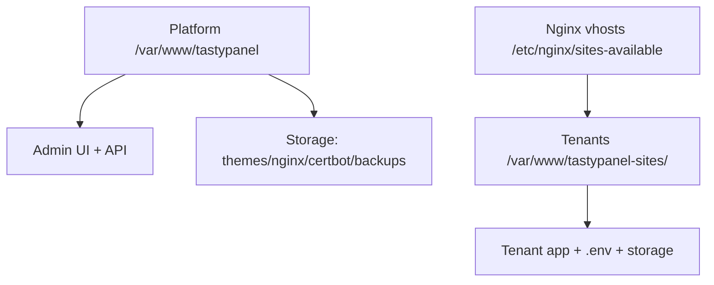

# Platform Structure (Pro Layout Guide)

This repository is the **platform control panel** (Laravel). The tenant sites are **separate apps** installed outside this repo.

## Why the current folders look "like a normal website"
Laravel has fixed, required folder names. If we rename them, the app breaks.

Must keep as‑is:
`app/`, `bootstrap/`, `config/`, `database/`, `public/`, `resources/`, `routes/`, `storage/`, `vendor/`, `artisan`

## Production Layout (recommended)
`/var/www/tastypanel` = Platform (this repo)
`/var/www/tastypanel-sites/<tenant-key>` = Each tenant site (separate Laravel app)

Each tenant has:
`<tenant>/ .env`
`<tenant>/storage`
`<tenant>/public`
Dedicated DB + PHP‑FPM pool + Nginx vhost

If one tenant crashes → only that tenant goes down.

## Platform vs Tenant (visual)

## Where things live
Platform repo (this project):
`app/` Laravel logic
`resources/` React admin UI + Blade views
`routes/` API + web routes
`infrastructure/` provisioning + automation scripts
`storage/` runtime files (themes, nginx, certbot, backups)

Tenant sites (generated by the platform):
`/var/www/tastypanel-sites/<tenant-key>/`
Each site is fully isolated with its own code, database, and storage.

## Clean “Pro” Organization (safe)
We do NOT rename Laravel core folders. Instead we keep them and document clearly.

Optional:
Create extra folders for organization only:
`docs/` → `documentation/` (architecture + operations)
`scripts/` → `infrastructure/` (provisioning, backups, deployment)
`infra/` (future) infra references and templates
`ops/` (future) runbooks and playbooks

If you want to move `infrastructure/` scripts, you must also update:
`config/services.php`
`.env.example`
`infrastructure/install-ubuntu-24.04.sh`

## Naming & Conventions
Tenant key: `<slug>-<tenant_id>` (example: `travel-12`)
Tenant root: `/var/www/tastypanel-sites/<tenant-key>`
Tenant DB: `tb_<tenant_id>`
Tenant PHP‑FPM socket: `/run/php/php8.3-fpm-<tenant-key>.sock`
Tenant logs:
`<tenant>/storage/logs/laravel.log`
`<tenant>/storage/logs/php-fpm.log`

## Rules (important)
Do not put tenant websites inside the platform repo.
Do not rename Laravel core folders.
Always provision new tenants using the panel so it creates DB + vhost + SSL correctly.

